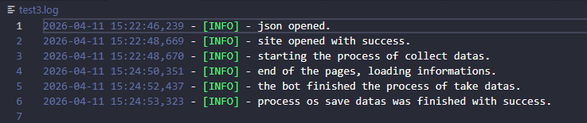
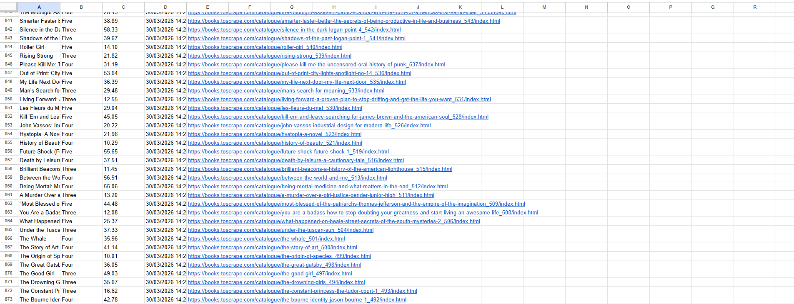

## 📚 web-scraper-site-books_to_scrape
Web scraper of the site "books.toscrape.com" with high quality data and numerical processing. This code extracts 5 key elements:

### 🔍 Elements Extracted:

* **Title:** Data extraction of the name of the book.
* **Rating:** Data extraction of the rating with an integrated filter to extract only books with 3 stars or above.
* **Price:** Numerical extraction (removes currency symbols), allowing direct interaction as a number for analysis.
* **Timestamping:** Records the collection date for data history and tracking.
* **Link:** Full URL extraction for immediate access to the source page.

### ⚙️ requirements:

# Python 3+
# Google Chrome installed
# libraries: pip install -r requirements.txt

### ⚙️ config:

# config.json: can change the filter of rating or url of the site, for example: 
# "stars": ["One", "Two"] - takes just books with one or two stars of rating.

# creds.json: necessary the input of credentials of API google cloud for Google sheets work.

### 🌟 technical highlights:

# Stealth Mode: use selenium_stealth to doesn´t be blocked
# Logging: create an archive test3.log to save the executed process by the bot
# Error Handling: the code contains error handling with try and except, working even with fasts internet outages

### 🎯 how to run:

1. Clone the repository.
2. install the requirements.
3. Rename the creds.json.example to creds.json and fill it with your Google Cloud Service Account credentials
4. you can custom the config.json if you want(opcional).
5. execute main.py

## 📊 results and performance:

### Execution logs

### data output (Google Sheets, CSV and XLSX)

# 🌟 I hope you like it! 
_Pythonic Effort_

obs: In this project, I used Selenium to demonstrate proficiency in browser automation and human behavior simulation. Although the website is static, the primary goal was to implement Explicit Waits and complex navigation techniques that are essential for handling SPAs (Single Page Applications).
 
